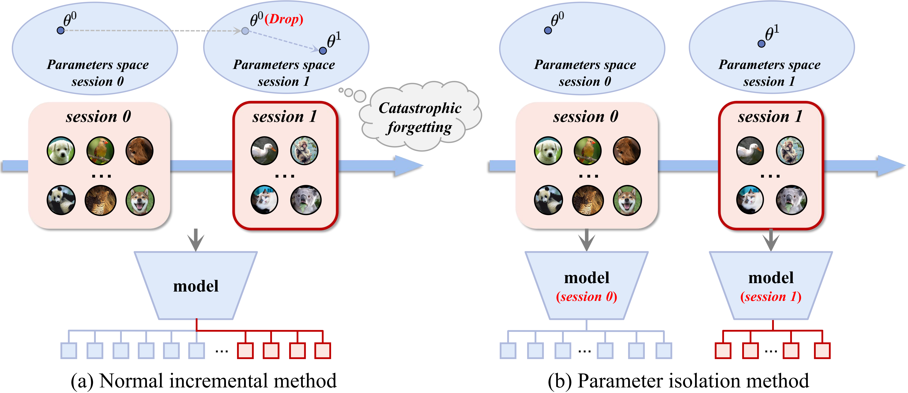
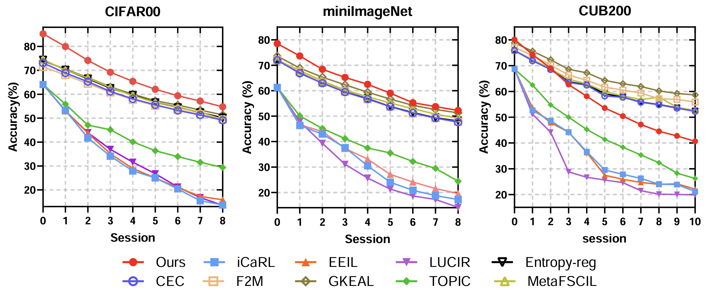

# Humankind-Memory-Inspired-Few-Shot-Class-Incremental-learning
## Abstract
Current mainstream deep learning techniques exhibit an over-reliance on extensive training data and a lack of adaptability to the dynamic world, marking a considerable disparity from human intelligence. To bridge this gap, _Few-Shot Class-Incremental Learning_ (FSCIL) has emerged, focusing on continuous learning of new categories with limited samples without forgetting old knowledge. Existing FSCIL studies typically use a single model to learn knowledge across all sessions, inevitably leading to the stability-plasticity dilemma. Unlike machines, humans store varied knowledge in different cerebral cortices. Inspired from this characteristic, our paper aims to develop the method which learns independent models for each session. It can inherently prevent catastrophic forgetting. During the testing phrase, our method integrates _Uncertainty Quantification_ (UQ) for model deployment. Our method provides a fresh viewpoint for FSCIL and demonstrates the state-of-the-art performance on CIFAR-100 and _mini_-ImageNet datasets.
## Methodology

## Results

| Method    | Session 0 | Session 1 | Session 2 | Session 3 | Session 4 | Session 5 | Session 6 | Session 7 | Session 8 | Average |
|-----------|-----------|-----------|-----------|-----------|-----------|-----------|-----------|-----------|-----------|------------|
| iCaRL     | 64.10     | 53.28     | 41.69     | 34.13     | 27.93     | 25.06     | 20.41     | 15.58     | 13.73     | 32.86      |
| EEIL      | 64.10     | 53.11     | 43.71     | 35.15     | 28.96     | 24.98     | 21.01     | 17.26     | 15.85     | 33.79      |
| LUCIR     | 64.10     | 53.05     | 43.96     | 36.97     | 31.61     | 26.73     | 21.23     | 16.78     | 13.54     | 34.21      |
| TOPIC     | 64.10     | 55.88     | 47.07     | 45.16     | 40.11     | 36.38     | 33.96     | 31.55     | 29.77     | 42.62      |
| CEC       | 73.07     | 68.88     | 65.26     | 61.19     | 58.09     | 55.57     | 53.22     | 51.34     | 49.14     | 59.52      |
| F2M       | 71.45     | 68.10     | 64.43     | 60.80     | 57.76     | 55.26     | 53.33     | 51.57     | 49.35     | 59.13      |
| MetaFSCIL | 74.50     | 70.10     | 66.84     | 62.77     | 59.48     | 56.52     | 54.36     | 52.56     | 49.47     | 60.73      |
| Entropy-reg | 74.40   | 70.20     | 66.54     | 62.51     | 59.71     | 56.58     | 54.52     | 52.29     | 50.14     | 60.77      |
| GKEAL     | 74.01     | 70.45     | 67.01     | 63.08     | 60.01     | 57.30     | 55.50     | 53.39     | 51.40     | 61.35      |
| **Ours**      | **85.30**     | **79.94**     | **74.16**     | **69.19**     | **65.40**     | **62.09**     | **59.40**     | **57.16**     | **54.73**     | **67.44**      |

| CM | BR | MS | SR | FT | Session 0 | Session 1 | Session 2 | Session 3 | Session 4 | Session 5 | Session 6 | Session 7 | Session 8 | Average |
|----|----|----|----|----|-----------|-----------|-----------|-----------|-----------|-----------|-----------|-----------|------------|------|
| $\checkmark$ | | |  | |82.93 | 76.35 | 71.22 | 66.32 | 61.88 | 58.65 | 55.71 | 52.71 | 49.37 | 63.90|
| $\checkmark$ | $\checkmark$ | |  | |82.93 | 26.32 | 23.27 | 9.72 | 15.73 | 4.34 | 4.18 | 1.78 | 13.71 | 20.22|
| $\checkmark$ | $\checkmark$ | $\checkmark$ |  | |82.93 | 72.06 | 64.45 | 59.03 | 55.51 | 51.49 | 49.08 | 46.95 | 43.98 | 58.38|
| $\checkmark$ | $\checkmark$ | $\checkmark$ | $\checkmark$ | |85.30 | 79.94 | 74.16 | 69.19 | 65.40 | 62.09 | 59.40 | 57.16 | 54.73 | 67.44|
| $\checkmark$ | $\checkmark$ | $\checkmark$ | $\checkmark$ | $\checkmark$ | **85.30**     | **79.94**     | **74.16**     | **69.19**     | **65.40**     | **62.09**     | **59.40**     | **57.16**     | **54.73**     | **67.44**      |
